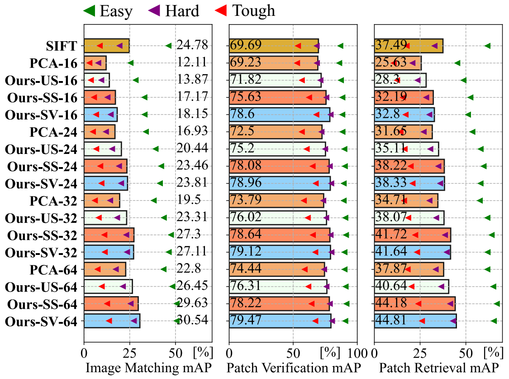
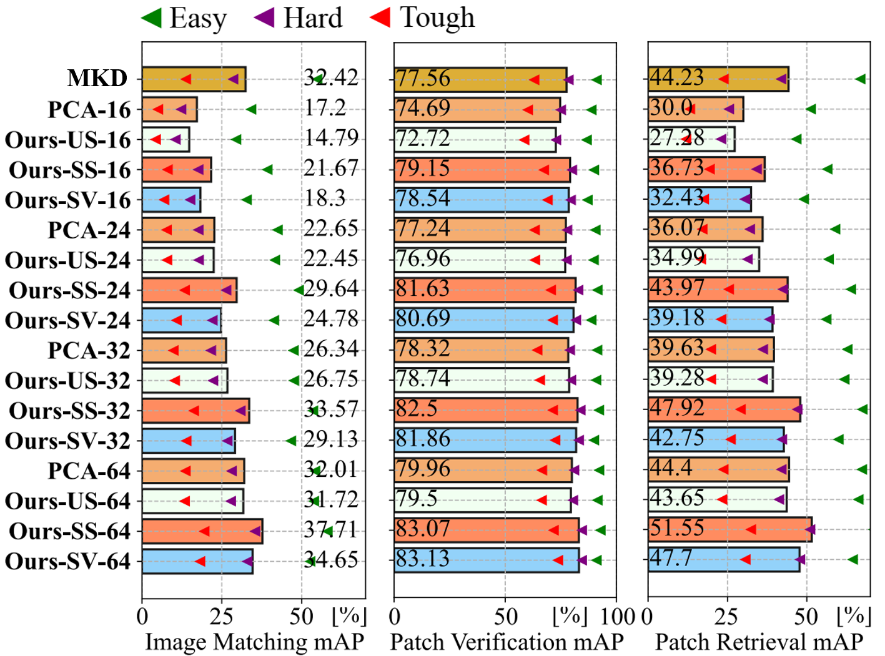
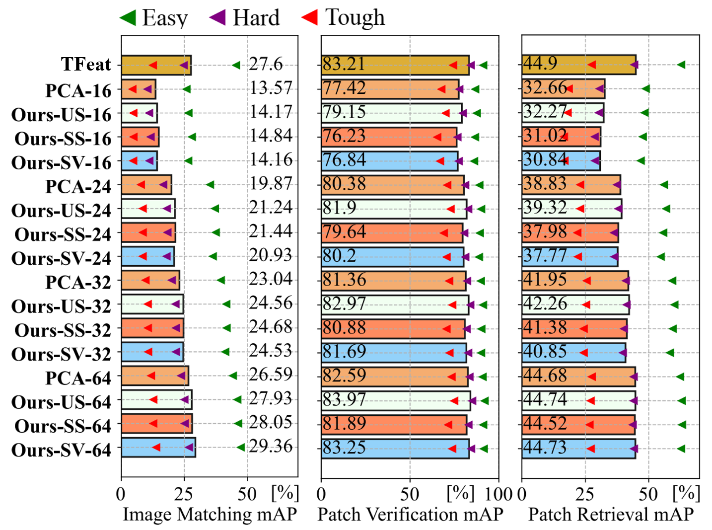
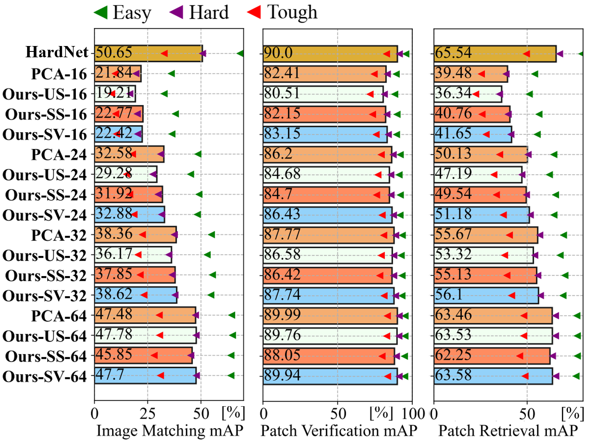

# Descriptors Dimensionality Reduction

This repository contains the implementation of the paper:

**Learning-Based Dimensionality Reduction for Computing Compact and Effective Local Feature Descriptors**  
[Hao Dong](https://sites.google.com/view/dong-hao/), [Xieyuanli Chen](https://www.ipb.uni-bonn.de/people/xieyuanli-chen/), [Mihai Dusmanu](https://dsmn.ml/), [Viktor Larsson](https://vlarsson.github.io/), [Marc Pollefeys](https://www.inf.ethz.ch/personal/pomarc/) and [Cyrill Stachniss](http://www.ipb.uni-bonn.de/people/cyrill-stachniss/)  
Submitted to the IEEE International Conference on Robotics and Automation (ICRA) 2023. [Link]() to the arXiv version of the paper (available soon).

We propose and evaluate an MLP-based network for descriptor dimensionality reduction and show its superiority over PCA on multiple descriptors in various tasks.

Overview of our approach. We first compute descriptors of given image patches. Then an MLP-based network is used for dimensionality reduction. We aim to learn an MLP-based projection better than PCA to generate lower-dimensional descriptors.

## Abstract
A distinctive representation of image patches in form of features is a key component of many computer vision and robotics tasks, such as image matching, image retrieval, and visual localization. State-of-the-art descriptors, from hand-crafted descriptors such as SIFT to learned ones such as HardNet, are usually high dimensional; 128 dimensions or even more. The higher the dimensionality, the larger the memory consumption and computational time for approaches using such descriptors. In this paper, we investigate multi-layer perceptrons (MLPs) to extract low-dimensional but high-quality descriptors. We thoroughly analyze our method in unsupervised, self-supervised, and supervised settings, and evaluate the dimensionality reduction results on four representative descriptors. We consider different applications, including visual localization, patch verification, image matching and retrieval. The experiments show that our lightweight MLPs achieve better dimensionality reduction than PCA. The lower-dimensional descriptors generated by our approach outperform the original higher-dimensional descriptors in downstream tasks, especially for the hand-crafted ones. 

## Code
Coming soon!

## Citation
If you use our framework for any academic work, please cite the original [paper]().

> bibtex entry coming soon!

## Supplementary

### Embedding visualization of the descriptors

   
&nbsp;&nbsp;&nbsp;&nbsp;&nbsp;&nbsp;&nbsp;&nbsp;&nbsp;&nbsp;&nbsp;&nbsp;&nbsp;&nbsp;&nbsp;&nbsp;&nbsp;&nbsp;&nbsp;&nbsp;&nbsp;&nbsp;&nbsp;&nbsp;SIFT&nbsp;&nbsp;&nbsp;&nbsp;&nbsp;&nbsp;&nbsp;&nbsp;&nbsp;&nbsp;&nbsp;&nbsp;&nbsp;&nbsp;&nbsp;&nbsp;&nbsp;&nbsp;&nbsp;&nbsp;&nbsp;&nbsp;&nbsp;&nbsp;&nbsp;&nbsp;&nbsp;&nbsp;&nbsp;&nbsp;&nbsp;&nbsp;&nbsp;&nbsp;&nbsp;&nbsp;&nbsp;&nbsp;SIFT-PCA-64&nbsp;&nbsp;&nbsp;&nbsp;&nbsp;&nbsp;&nbsp;&nbsp;&nbsp;&nbsp;&nbsp;&nbsp;&nbsp;&nbsp;&nbsp;&nbsp;&nbsp;&nbsp;&nbsp;&nbsp;&nbsp;&nbsp;&nbsp;&nbsp;&nbsp;&nbsp;&nbsp;&nbsp;&nbsp;SIFT-Ours-SV-64  
   
&nbsp;&nbsp;&nbsp;&nbsp;&nbsp;&nbsp;&nbsp;&nbsp;&nbsp;&nbsp;&nbsp;&nbsp;&nbsp;&nbsp;&nbsp;&nbsp;&nbsp;&nbsp;&nbsp;&nbsp;&nbsp;&nbsp;&nbsp;&nbsp;MKD&nbsp;&nbsp;&nbsp;&nbsp;&nbsp;&nbsp;&nbsp;&nbsp;&nbsp;&nbsp;&nbsp;&nbsp;&nbsp;&nbsp;&nbsp;&nbsp;&nbsp;&nbsp;&nbsp;&nbsp;&nbsp;&nbsp;&nbsp;&nbsp;&nbsp;&nbsp;&nbsp;&nbsp;&nbsp;&nbsp;&nbsp;&nbsp;&nbsp;&nbsp;&nbsp;&nbsp;&nbsp;MKD-PCA-64&nbsp;&nbsp;&nbsp;&nbsp;&nbsp;&nbsp;&nbsp;&nbsp;&nbsp;&nbsp;&nbsp;&nbsp;&nbsp;&nbsp;&nbsp;&nbsp;&nbsp;&nbsp;&nbsp;&nbsp;&nbsp;&nbsp;&nbsp;&nbsp;&nbsp;&nbsp;&nbsp;&nbsp;MKD-Ours-SV-64  
   
&nbsp;&nbsp;&nbsp;&nbsp;&nbsp;&nbsp;&nbsp;&nbsp;&nbsp;&nbsp;&nbsp;&nbsp;&nbsp;&nbsp;&nbsp;&nbsp;&nbsp;&nbsp;&nbsp;&nbsp;&nbsp;&nbsp;&nbsp;&nbsp;TFeat&nbsp;&nbsp;&nbsp;&nbsp;&nbsp;&nbsp;&nbsp;&nbsp;&nbsp;&nbsp;&nbsp;&nbsp;&nbsp;&nbsp;&nbsp;&nbsp;&nbsp;&nbsp;&nbsp;&nbsp;&nbsp;&nbsp;&nbsp;&nbsp;&nbsp;&nbsp;&nbsp;&nbsp;&nbsp;&nbsp;&nbsp;&nbsp;&nbsp;&nbsp;&nbsp;&nbsp;&nbsp;TFeat-PCA-64&nbsp;&nbsp;&nbsp;&nbsp;&nbsp;&nbsp;&nbsp;&nbsp;&nbsp;&nbsp;&nbsp;&nbsp;&nbsp;&nbsp;&nbsp;&nbsp;&nbsp;&nbsp;&nbsp;&nbsp;&nbsp;&nbsp;&nbsp;&nbsp;&nbsp;TFeat-Ours-SV-64  
   
&nbsp;&nbsp;&nbsp;&nbsp;&nbsp;&nbsp;&nbsp;&nbsp;&nbsp;&nbsp;&nbsp;&nbsp;&nbsp;&nbsp;&nbsp;&nbsp;&nbsp;&nbsp;&nbsp;&nbsp;&nbsp;&nbsp;&nbsp;&nbsp;HardNet&nbsp;&nbsp;&nbsp;&nbsp;&nbsp;&nbsp;&nbsp;&nbsp;&nbsp;&nbsp;&nbsp;&nbsp;&nbsp;&nbsp;&nbsp;&nbsp;&nbsp;&nbsp;&nbsp;&nbsp;&nbsp;&nbsp;&nbsp;&nbsp;&nbsp;&nbsp;&nbsp;&nbsp;&nbsp;&nbsp;HardNet-PCA-64&nbsp;&nbsp;&nbsp;&nbsp;&nbsp;&nbsp;&nbsp;&nbsp;&nbsp;&nbsp;&nbsp;&nbsp;&nbsp;&nbsp;&nbsp;&nbsp;&nbsp;&nbsp;&nbsp;&nbsp;&nbsp;&nbsp;HardNet-Ours-SV-64  

We provide the t-SNE embedding visualization of the descriptors on UBC Phototour Liberty. We visualize the embeddings of SIFT, MKD, TFeat, and HardNet generated using PCA and supervised methods by mapping high-dimensional descriptors (128 and 64) into 2D using t-SNE visualization. We pass the image patches through the descriptor extractor, followed by PCA or MLPs, to get lower-dimensional descriptors and determine their 2D locations using t-SNE transformation. Finally, we visualize the entire patch at each location.

From the visualization, we can observe similar results as we discussed in the paper. For SIFT and MKD, the original descriptor space is irregular, and similar and dissimilar features are overlapped. Therefore, PCA projection will keep this irregular structure of the descriptor space. However, after learning a more discriminative representation using triplet loss, similar image patches in the descriptor space are close to each other while dissimilar ones have distances from each other. For TFeat and HardNet, since the outputting space is already optimized for the $\ell_2$ metric, image patches in the descriptor space are already separated well based on their appearance. Therefore, a simple PCA can preserve this distinctive structure and perform on par compared with the learned projection.  

### Experiments for patch verification, image matching, and patch retrieval on HPatches dataset
   
   
   
   
